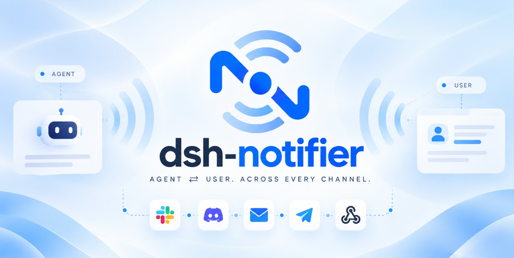
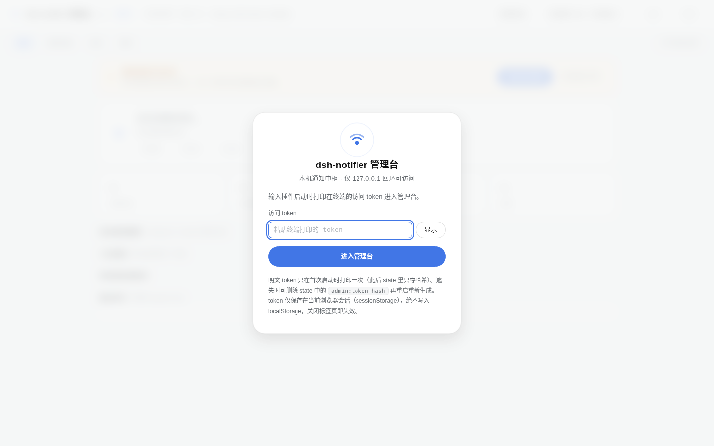
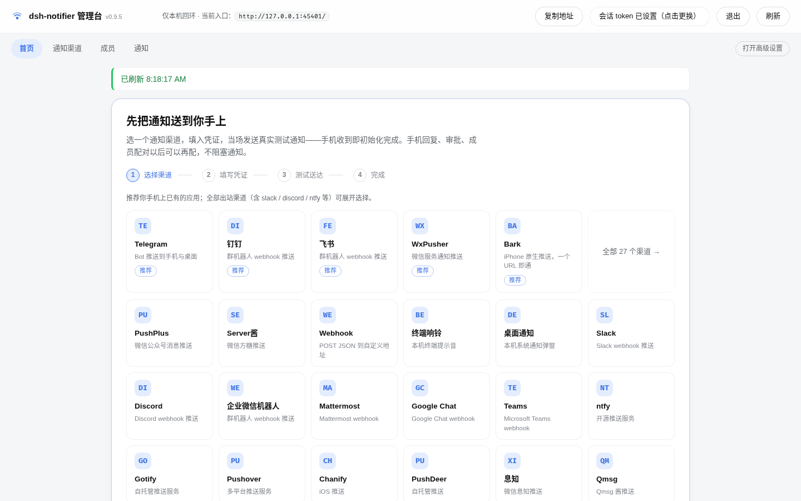
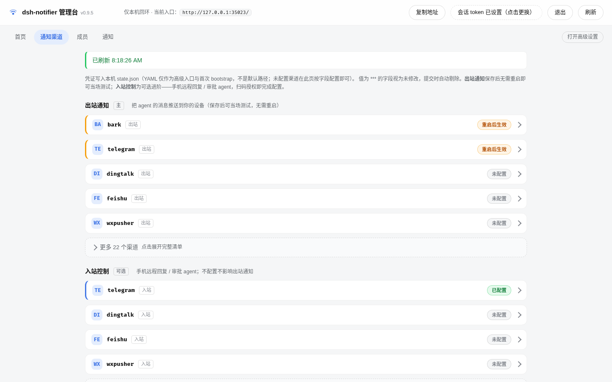
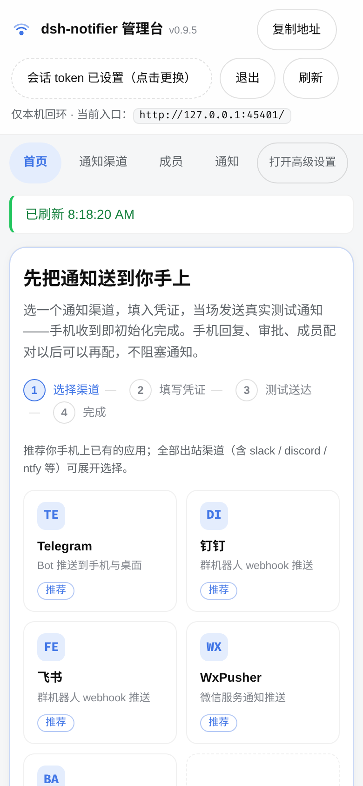
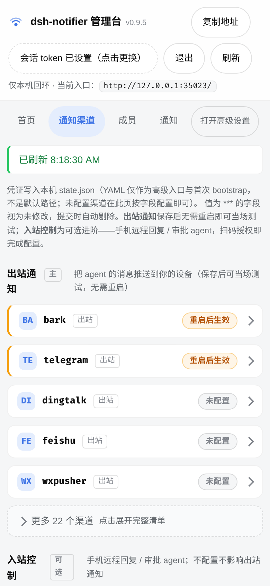
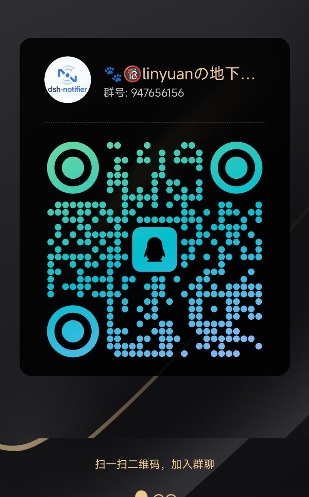

<p align="center">
  
</p>

<div align="center">

# dsh-notifier

**Your agent, in your pocket.**

把 DeepSeek Harness 放进手机里：**28 个出站通知渠道、6 个入站控制渠道**，通知、审批、提问、远程会话和任务/Session 控制统一收口。

[English](README.md) · [快速指南](docs/guide.md) · [排障](docs/TROUBLESHOOTING.md) · [兼容性](docs/compatibility-matrix.md)

<p>
  <a href="https://www.npmjs.com/package/dsh-notifier"></a>
  <a href="LICENSE"></a>
  <a href="https://dshfind.com/zh/plugins/THEWOLFWALKER/dsh-notifier?ref=badge"></a>
</p>

</div>

<p align="center">
  
  `dsh-notifier@0.13.1` · test/ 2011 个测试 · 2011 个自动化契约测试
</p>

## 它解决什么

dsh-notifier 是 DeepSeek Harness 的通知与远程操作层。最核心的使用场景很简单：**你离开 DSH 窗口以后，仍然知道 Agent 在干什么；需要你时，直接从手机处理。**

- **随时收到通知**：任务完成、审批、错误、长任务状态，以及模型主动触发的通知。
- **手机直接处理**：批准/拒绝、回答 `ask_user`、继续对话、纠偏正在执行的任务、切换任务或 Session。
- **日常管理留在 DSH**：Native **「通知与控制」** 是主入口；高级管理台只负责成员、绑定、Session、诊断和 Recovery。
- **失败尽量局部化**：未知/未绑定的入站操作 fail-closed；单个通知渠道失败不拖垮其他渠道。

## 界面预览

<table>
  <tr>
    <td></td>
    <td></td>
  </tr>
  <tr>
    <td></td>
    <td></td>
  </tr>
  <tr>
    <td></td>
    <td></td>
  </tr>
</table>

## 安装

### 一句话让 AI 帮你装

把下面这句话发给**能操作当前机器终端**的 AI / Agent：

> 请帮我在这台机器上安装或升级 **dsh-notifier 最新稳定版**。先自动识别当前正在使用的 DSH profile 和现有安装来源，确认 DSH / Node 版本兼容，并保护已有配置；不要修改无关插件，也不要打印任何 Token / Secret。使用官方发布包完成安装，重启对应 DSH Host 一次，确认实际安装版本和 **「通知与控制」** 入口，最后把你执行过的命令、结果和仍存在的异常汇报给我。项目：`https://github.com/THEWOLFWALKER/dsh-notifier`

更完整、适合直接交给 Codex / Claude Code / Cursor / 终端 Agent 的版本见：[AI 安装指南](docs/AI_INSTALL.md)。

### 自己安装

```bash
dsh plugin add dsh-notifier@latest --profile <profile名>
```

安装后重启 DSH 一次，让新的 Host 插件和 `client.js` 装载。然后：

1. 从 DSH 侧栏打开 **「通知与控制」**，或进入 **Plugins → dsh-notifier**；
2. 选一个你已经在用的通知渠道；
3. 填凭证，点 **「保存并测试」**；
4. 如果提供方只确认 API 已接受请求，而没有端到端 receipt，请到手机实际确认；“provider accepted”不会被写成“确认送达”。

装好以后，**出站配置修改会 Hot Apply**。入站 SDK / WebSocket / 长轮询如果页面显示 **「等待重启」**，仍需要重启来重建连接。

## 你需要哪一种用法

| 你的目标 | 从这里开始 |
| --- | --- |
| 只想收到任务通知 | 在「通知与控制」配置一个出站渠道 |
| 想在手机批准 / 回答问题 | 再配置一个支持的入站渠道，然后完成成员配对 |
| 想直接在手机和 Agent 对话 | 配对后，在机器人私聊直接发文字 |
| 想中途纠偏正在执行的任务 | 在已绑定私聊发送 `! <补充指令>` |
| 想管理成员、绑定、Session、Recovery | 从 Native 打开「高级管理台」 |
| Headless / 自动化部署 | 看 [完整指南](docs/guide.md) 的 YAML / CLI 部分 |

## 支持的渠道

**出站 28 个：** Bark、Bell、Chanify、Desktop、钉钉、Discord、飞书、Google Chat、Gotify、iGot、Mattermost、ntfy、OneBot 11、PushDeer、Pushover、PushPlus、Qmsg、QQ 官方机器人、Server酱、Slack、Microsoft Teams、Telegram、Webhook、企业微信群机器人、企业微信应用、WPS Bot、WxPusher、息知。

**入站控制 6 个：** Telegram、飞书、QQ 官方机器人、WxPusher、微信 iLink、钉钉。

不同 provider 的按钮、附件、送达回执、重连、账号额度并不一样。项目只按真实证据等级声明能力，详见 [兼容性矩阵](docs/compatibility-matrix.md)。

<details>
<summary><strong>常用私聊命令</strong></summary>

| 命令 | 用途 |
| --- | --- |
| `/help` | 查看命令 |
| `/whoami` | 查看身份 / 配对状态 |
| `/status` | 当前路由 / Session 状态 |
| `/tasks` / `/use …` | 查看或选择活跃任务 |
| `/sessions` | Session 概览 |
| `/stop` | 停止当前 turn |
| `/route` | 查看双向路由 |
| `/quiet …` / `/unquiet …` | 静默 / 恢复通知 |
| `/pair <码>` / `/unpair` | 配对 / 解绑入站身份 |
| `/log [N]` | 有界、脱敏的近期通知摘要；默认关闭且仅 owner |

普通文字会继续和 Agent 对话；前缀 `!` 会纠偏当前正在执行的 turn。群聊默认不开放高风险远程控制语义。

</details>

## 工作方式

```text
DSH 事件 / notify() / 其它插件
                 │
                 ▼
        dsh-notifier core
        ┌────────┴────────┐
        ▼                 ▼
    28 个出站          health / activity
        │                 │
        ▼                 │
       手机               │
        │                 │
        └─ 6 个入站 ──────┘
              │
              ▼
       identity + Control Core
审批 · ask_user · 会话 · 任务/Session 控制
```

Native UI、notifier runtime、高级管理台和测试尽量围绕同一份真实状态工作，不维护“页面看起来已经改了、运行时其实没改”的第二套真相。

## 遇到问题：先让 AI 帮你定位，再上报

**不要一上来就把一大段日志贴进 Issue。** 推荐支持流程：

1. 把 [AI 排障提示词](docs/TROUBLESHOOTING.md) 发给能读当前终端/日志的 AI；
2. 先做**只读诊断**：确认实际安装版本、DSH profile / 版本、安装来源、问题属于哪个子系统，并做最小复现；全程脱敏；
3. 如果只是旧包、错误 profile、残留 `file:` 安装、漏重启、凭证或 provider 配置问题，让 AI 协助本地解决并重新验证；
4. 如果仍解决不了，让 AI 按 [定位与诊断指南](docs/DIAGNOSTICS.md) 生成一份短小、可复现的报告；
5. 再把这份报告发到 GitHub Issue / QQ 群 / 邮箱。

这样维护者拿到的是“已经排除常见环境问题后的证据”，不是聊天记录和猜测。

## 文档

| 文档 | 用来干什么 |
| --- | --- |
| [完整指南](docs/guide.md) | 安装、首访、出站/入站、配对、日常使用 |
| [AI 安装](docs/AI_INSTALL.md) | 一句话 / 完整提示词，让终端 Agent 安全安装 |
| [排障指南](docs/TROUBLESHOOTING.md) | 人类 + AI 的第一轮问题定位 |
| [定位与诊断](docs/DIAGNOSTICS.md) | 收集证据、生成 Support Report |
| [兼容性](docs/compatibility-matrix.md) | DSH / 可选 SDK / provider 的证据等级 |
| [升级指南](docs/upgrade-guide.md) | 更新、确认实际版本、清理残留、回滚 |
| [插件 API](PLUGINS.md) | `ctx.notifier` 消费方接口 |
| [架构](docs/architecture.md) | 内部设计与运行时权威 |
| [变更记录](CHANGELOG.md) | 版本历史 |

## 联系方式

可稳定复现的产品问题，优先走**AI 预排障后的 GitHub Issue**。

- QQ：**3622976831**
- 邮箱：**3622976831@qq.com**
- QQ 群：**947656156**

<p align="center">
  
</p>

不要通过 Issue、QQ 或邮件发送 Bot Token、Webhook Secret、Admin Token、完整 `state.json` 或未脱敏的私聊内容。

> **维护公告**：至 **2026-10-01** 前作者因考试，回复可能较慢。

## 开发信息

Node.js **22+**、ESM、**零强制运行时依赖**。部分 provider 的扫码/接入能力使用 optional dependency，仅在需要时加载。

开发、验证和发布规则见 [AGENTS.md](AGENTS.md)、[OPERATIONS](docs/OPERATIONS.md) 和仓库测试。

## License

MIT
