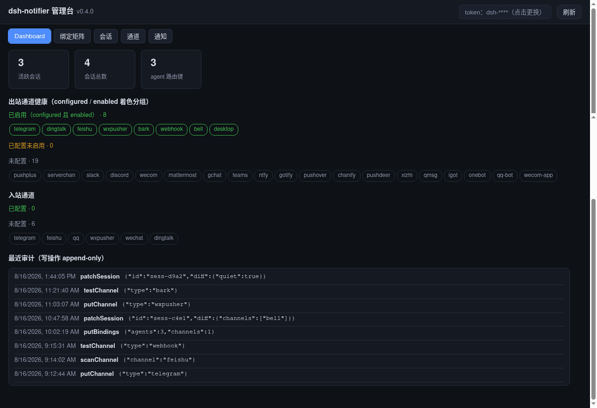
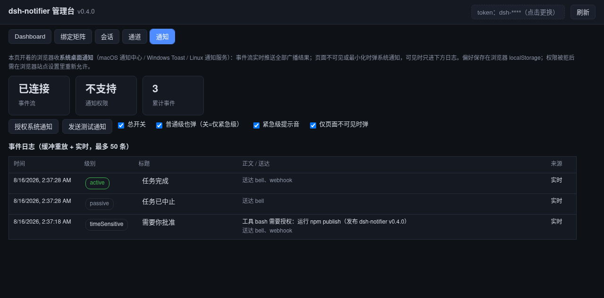
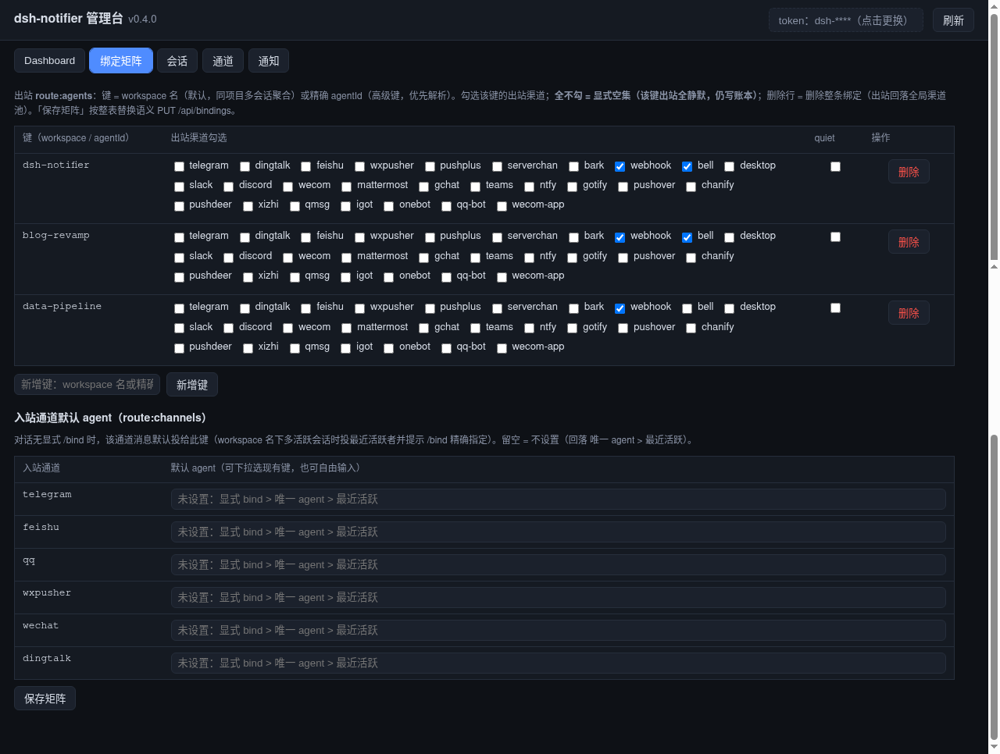
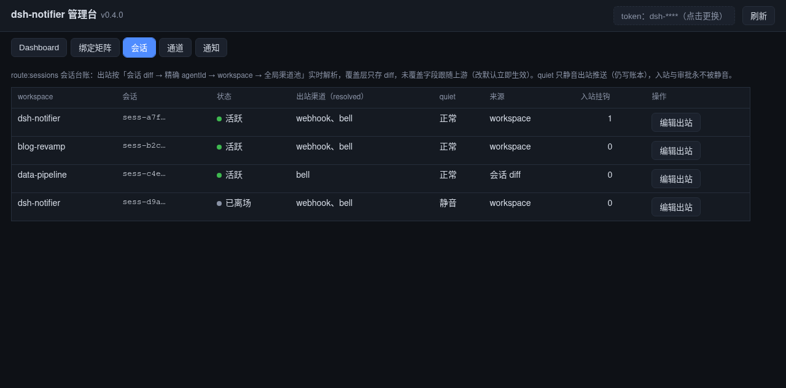
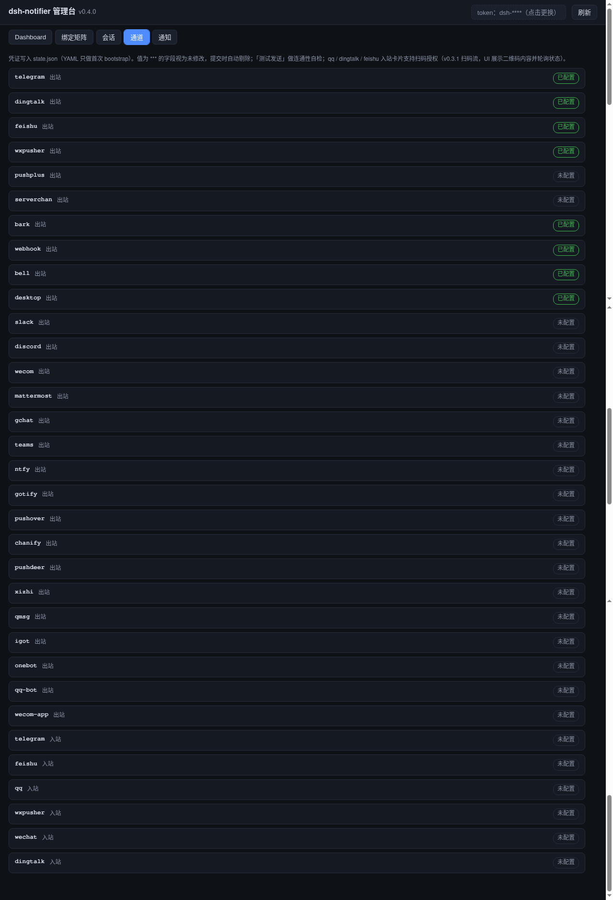

# dsh-notifier

[**English**](README.md) · **简体中文**


面向 [DeepSeek Harness](https://github.com/deepseek-ai/deepseek-harness)（DSH）的统一通知推送插件 —— 前端一个极简 `notify()` API，背后 25+ 渠道。

你的 agent 和宿主本身都能经它推送：会话事件（`turn/end` · `approval/asked` · `agent/error`）自动通知，模型可直接调用 `notify` 工具，六条入站通道把审批与对话从手机带回。v0.3 加入本机网页控制台与多 agent 路由，v0.4 加入系统桌面通知 —— 全程零运行时依赖。

## 工作原理

```
DSH Agent ─notify() 工具───────┐
                               ├─▶ notifier 核心 ─▶ 25+ 渠道（IM webhook / 推送 App / 国内生态）
DSH 会话事件 ─自动推送──────────┘   分级路由 · 分档重试 · 长消息分段 · 防打扰 · 账本
你的手机 ─6 条入站通道──────────▶   远程审批（按钮 · 回复 1/2） · 远程会话（followup/inject/steer）
```

每条消息都走同一条链路解析 —— 分级（`timeSensitive` / `active` / `passive`）→ 路由（多 agent 矩阵）→ 渠道适配器（`resolve(cfg)` + `send(msg)`）。两条触发线喂入核心：宿主自动推送会话事件（防抖、去重），模型直接调用 `notify` 工具。六条入站通道反向复用同一核心，承接审批与对话。

## 快速开始

```bash
dsh plugin add dsh-notifier
```

把渠道加进你的 profile patch（`cordis.patch.yml`）：

```yaml
insert:
  - id: dsh-notifier
    name: dsh-notifier
    config:
      channels:
        - type: telegram
          botToken: "123456:ABC-DEF..."
          chatId: "987654321"
        - type: dingtalk
          webhook: "https://oapi.dingtalk.com/robot/send?access_token=..."
          secret: "SEC..."
        - type: bark
          key: "your-device-key"
```

完成。`turn/end`、`approval/asked`、`agent/error` 事件即推送到所有已配置渠道，模型也能用 `notify({ message, channel, title })` 主动推送。

## 核心功能

| 功能 | 说明 |
|---|---|
| **双触发线** | 自动状态推送（`turn/end` · `approval/asked` · `agent/error`）+ 模型侧 `notify` 工具。 |
| **25+ 渠道** | Telegram / Slack / Discord / 飞书 / 钉钉 / 企微 / QQ 机器人 / OneBot / Teams / Mattermost / Google Chat / Bark / Pushover / PushDeer / Chanify / ntfy / Gotify / iGot / WxPusher / PushPlus / Server酱 / Qmsg / 息知 / webhook / bell —— 零运行时依赖。 |
| **分级路由** | `timeSensitive` / `active` / `passive` → 各渠道原生送达语义（静默推送、优先级标头、@提醒），配分档重试。 |
| **远程审批** | 手机上回答审批 —— Telegram 按钮、飞书卡片、QQ / WxPusher / 微信 iLink / 钉钉回复 `1`/`2`。沉默永不批准。 |
| **远程会话** | 与 agent 对话：纯文本 → `followup`/`inject`，`!` 前缀中途纠偏，合并窗拼回手机碎片输入。 |
| **多 agent 路由**（v0.3.2） | agent × 通道双向矩阵；会话创建即建档；`/agent` 命令族 + `route.mjs` CLI。 |
| **Web 管理台**（v0.3.3） | 仅绑 127.0.0.1 + Bearer token；五页 —— 总览 / 通知 / 绑定 / 会话 / 通道。 |
| **扫码授权**（v0.3.1） | QQ / 钉钉 / 飞书一条命令官方扫码授权（微信保持 iLink）。 |
| **桌面通知**（v0.4.0） | `desktop` 原生渠道（`osascript` / `notify-send` / PowerShell toast）+ 管理台 SSE 实时流。 |
| **长消息分段** | 超出预算的消息按序切成带 `（i/n）` 前缀的多段。 |
| **防打扰规则** | 事件按结果分控、关键词 include/exclude、空闲宽限窗。 |
| **账本 + 每日摘要** | 只追加 JSONL 账本 + 昨日流量一条 `passive` 摘要。 |
| **密钥安全** | `role('secret')` 密钥处处脱敏；`${ENV:NAME}` 引用让密钥不落 profile。 |
| **绝不搞崩启动** | 配错的渠道静默跳过并留一行日志。 |

## 配置项

所有渠道都在 `config.channels` 下。关键示例：

```yaml
insert:
  - id: dsh-notifier
    config:
      channels:
        - type: telegram
          botToken: "123456:ABC-DEF..."
          chatId: "987654321"
        - type: feishu
          webhook: "https://open.feishu.cn/open-apis/bot/v2/hook/..."
        - type: wxpusher
          appToken: "AT_..."
          uids: ["UID_..."]
        - type: serverchan
          sct: "SCT..."
```

可选模块各自在专属键下显式开启：

| 模块 | 用途 | 键 |
|---|---|---|
| `inbound` | 远程审批 + 远程会话 | `allowUsers: [...]` |
| `approval` | 超时、编号回复、升级提醒 | `mode: answer` |
| `conversation` | 合并窗、steer 前缀 | `mergeWindowMs: 1500` |
| `route` | 多 agent 路由 | `sessionTtlHours: 24` |
| `admin` | 网页控制台 | `enabled: true, port: 8104` |
| `events` / `keywords` / `graceSeconds` | 防打扰闸门 | `exclude: ["heartbeat"]` |
| `digest` | 账本 + 每日摘要 | `enabled: true` |

## 渠道

<!-- CHANNEL-MATRIX-START -->

| type | 渠道 | 凭证 | 免费? |
|---|---|---|---|
| `bark` | Bark (iOS) | device key（或自架 URL） | ✅ |
| `bell` | 终端响铃（本地） | — | 本地 |
| `chanify` | Chanify (iOS) | token（或自架） | ✅ |
| `desktop` | 系统桌面通知（本地） | —（Windows 需 BurntToast 模块） | 本地 |
| `dingtalk` | 钉钉自定义机器人 | webhook + secret（HMAC 加签） | ✅ |
| `discord` | Discord webhook | webhook URL | ✅ |
| `feishu` | 飞书自定义机器人 | webhook（+ 加签 secret） | ✅ |
| `gchat` | Google Chat | space webhook URL | ✅ |
| `gotify` | Gotify | 服务器 URL + app token | 自架 |
| `igot` | iGot (iOS) | push key | ✅（限量） |
| `mattermost` | Mattermost | base URL + token（+ channel） | 自架 |
| `ntfy` | ntfy | topic（+ 服务器 URL） | ✅（可自架） |
| `onebot` | OneBot 11 (QQ) | HTTP endpoint | 自架 |
| `pushdeer` | PushDeer | push key | ✅ |
| `pushover` | Pushover | user key + app token | 付费（一次性） |
| `pushplus` | PushPlus（微信） | token | ✅（限量） |
| `qmsg` | Qmsg酱 (QQ) | key + QQ 号 | ✅（限量） |
| `qq-bot` | QQ 官方机器人 | appId + appSecret | ✅ |
| `serverchan` | Server酱（微信） | sendkey | ✅（限量） |
| `slack` | Slack | incoming webhook URL | ✅ |
| `teams` | Microsoft Teams | Power Automate workflow URL | ✅ |
| `telegram` | Telegram Bot API | bot token + chat id | ✅ |
| `webhook` | 任意自定义端点 | — | — |
| `wecom` | 企业微信群机器人 | webhook key | ✅ |
| `wecom-app` | 企业微信应用消息 | corpid + agentId + secret | ✅ |
| `wxpusher` | WxPusher（微信） | appToken + uid | ✅（限量） |
| `xizhi` | 息知 | sendkey | ✅（限量） |

<!-- CHANNEL-MATRIX-END -->

另有六个渠道开启入站（远程审批 + 远程会话）：`telegram`、`feishu`、`qq-bot`、`wxpusher`、`wechat`、`dingtalk` —— 长连接或长轮询，无需公网 IP（仅 WxPusher 回调需要公网可达）。

## 界面预览

Web 管理台（`admin.enabled: true`，仅绑 127.0.0.1）五页实拍（演示数据）：

| 页面 | 内容 |
|---|---|
| **Dashboard 总览** | 会话统计、出/入站通道健康分组、最近审计 |
| **通知页**（v0.4.0） | SSE 事件流实时推送、系统通知偏好、事件日志 |
| **绑定矩阵** | agent × 通道勾选网格、入站通道默认 agent |
| **会话台账** | 每会话出站解析与覆盖编辑 |
| **通道管理** | 全部渠道凭证建单（处处脱敏 `***`）、测试发送、扫码授权 |







## 架构

```
src/
  adapters/           25+ 渠道适配器（resolve(cfg) + send(msg)）+ 声明式 spec 引擎
  config.mjs          渠道注册表 + 配置 schema —— 矩阵唯一事实来源
  index.mjs           插件装配：patch、工具、事件监听、admin 接线
  event-listener.mjs  自动推送线（防抖、去重、分级路由）
  notify.mjs          notify / notify_test 工具 + 滑动窗口限流
  routing/            多 agent 矩阵（resolveOutbound / resolveInbound）
  inbound/            六条入站通道（telegram/feishu/qq/wxpusher/wechat/dingtalk）
  approval/           HMAC 一次性 token、去重、升级
  admin/              网页控制台（5 页、SSE、bearer 鉴权）
  ledger.mjs          JSONL 账本 + 每日摘要
  rules.mjs           防打扰闸门（事件 / 关键词 / 宽限窗）
scripts/              channel-login.mjs · test-channel.mjs · route.mjs · gen-channel-matrix.mjs
test/                 625 个测试（node --test）
```

设计准则：纯 ESM（`.mjs`）、零运行时依赖、绝大多数渠道走声明式 spec 引擎、适配器薄而诚实、无构建步骤。

## 开发

```bash
npm test          # node --test，625 个用例
```

新增渠道：在 `src/adapters/` 实现适配器接口（`resolve(cfg)` + `send(msg)`），并在 `src/config.mjs` 注册；上方渠道矩阵由 `node scripts/gen-channel-matrix.mjs` 自动重生成。

## 许可

[MIT](LICENSE) · 第三方声明见 [THIRD_PARTY_NOTICES.md](THIRD_PARTY_NOTICES.md)
