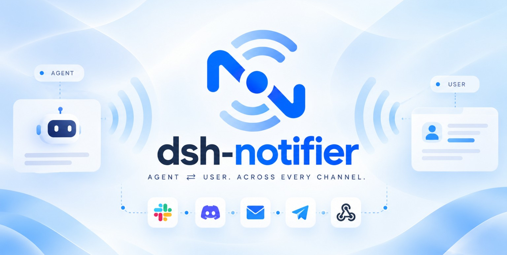
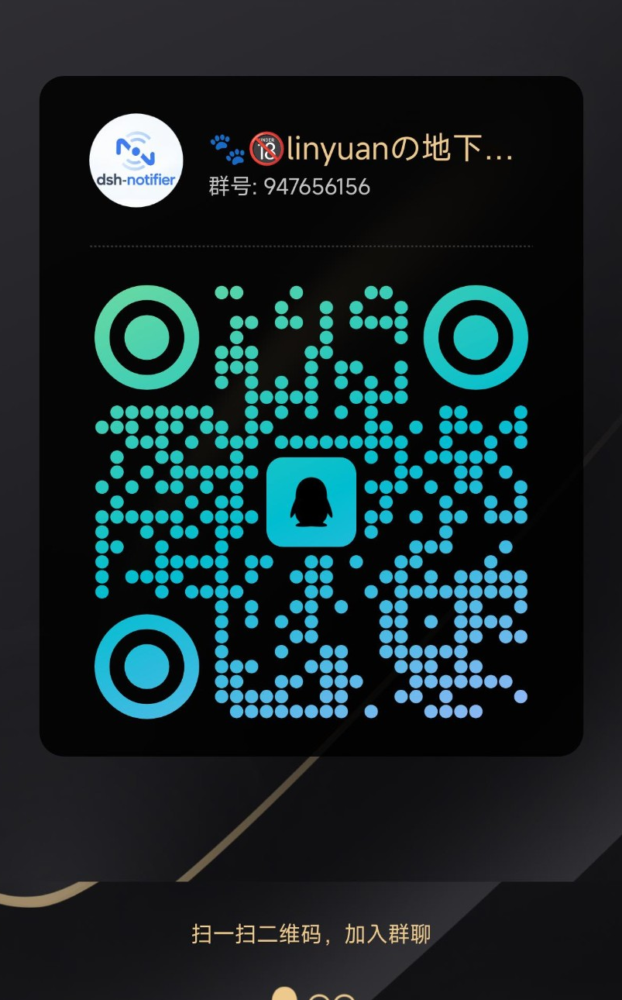

<p align="center"></p>

# dsh-notifier

离开电脑，也能知道任务进展。

把 DeepSeek Harness 的任务通知送到手机，需要时直接回复、回答提问或处理审批。支持 Telegram、Bark、微信、QQ、飞书、钉钉等 28 种通知渠道。

[English](README.md) · [使用指南](docs/user/guide.md) · [常见问题](docs/user/TROUBLESHOOTING.md)

[](https://www.npmjs.com/package/dsh-notifier) [](LICENSE) [](https://dshfind.com/en/plugins/THEWOLFWALKER/dsh-notifier?ref=badge)

`dsh-notifier@0.13.1`

## 开始使用

把 `<profile名>` 换成你正在使用的 DSH 配置名称，然后执行：

```bash
dsh plugin add dsh-notifier@latest --profile <profile名>
```

重启 DSH 并刷新页面，打开侧栏的「通知与控制」。选择一个通知渠道，按提示填写并保存，再点击「测试」，打开手机查看消息。

只需要接收通知，到这里就可以了。想从手机回复时，继续配置接收消息并[完成配对](docs/user/guide.md#从手机回复)。

也可以请助手[帮忙安装](docs/user/AI_INSTALL.md)。

## Telegram 一键网关

Telegram 连接不通时，在渠道配置里点击「一键开启网关」。登录 Cloudflare、选择账号后，插件会部署反代、获取地址，并自动填写保存。沿用原来的机器人凭证，无需另管一把密钥。

已有网关时，选择「自定义网关地址」并填入地址即可。[查看步骤](docs/user/cloudflare.md)。

## 换电脑也方便

在「通知渠道」里导出配置，在另一台电脑导入前先查看变化，再决定保留哪些设置。密码和机器人凭证不会写入导出文件，导入后按提示补齐。

## 需要帮助

先看[常见问题](docs/user/TROUBLESHOOTING.md)。仍有问题时，按照[反馈说明](docs/user/SUPPORT.md)提供操作步骤和诊断摘要。

QQ：3622976831 · 邮箱：3622976831@qq.com · QQ 群：947656156

<p align="center"></p>

开发、接入和维护说明集中在 [docs/developer](docs/developer/README.md)。

MIT；随附云端模板的许可见 [第三方说明](THIRD_PARTY_NOTICES.md)。
